# w2m

Autor: Marco Aurelio Guado Zavaleta  
Barcelona 04 Mayo 2021  
  
********** SI TIENES HERRAMIENTAS QUE TE FACILITAN EL TRABAJO, USALAS! ******************

## Development

Entorno:  
Linux ubuntu 20.04  
Jdk 11  
Maven 3.6.3  
Postman  
  
Para desplegar la aplicacion en modo dev ejecutar:  
cd w2m  

```
./mvnw
```
  
## Building for production

### Packaging as jar

Empaquetamos la w2m aplicacion para producción, run:

```

./mvnw -Pprod clean verify


```

To ensure everything worked, run:

```

java -jar target/*.jar


```

### Packaging as war

Si queremos desplear el war en el  server, run:

```

./mvnw -Pprod,war clean verify


```

## Testing

Realizamos los tests, run:

```
./mvnw verify
```

## PRUEBAS  
  
Usando el cliente Postman ejecutamos las pruebas:

1. Consulta de todos los registros:  

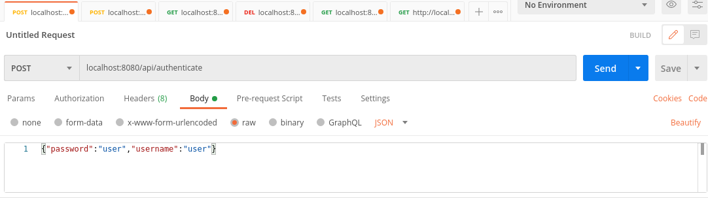  
  
La respuesta es un JSON de jwt que guardamos en el cliente Postman para realizar las consultas.  
  
Creamos los datos, ingresamos 5 registros  
  
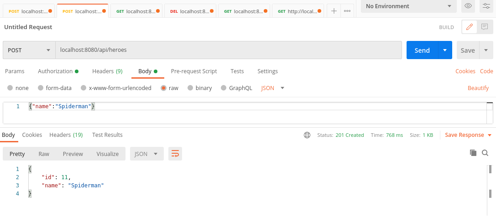  
  

select de todos los registros  

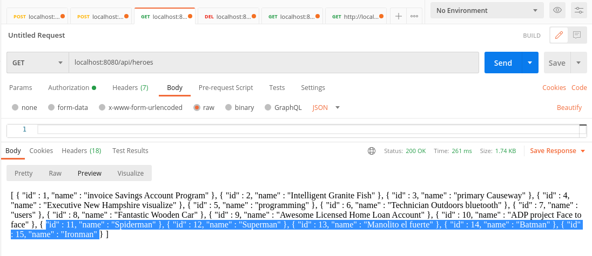  


2. Consulta por Id  
  
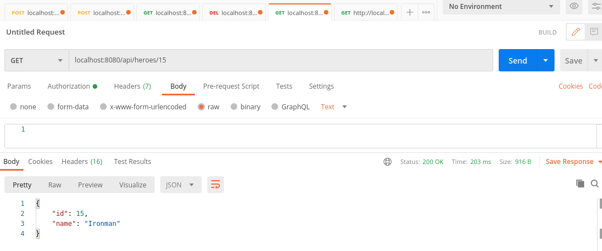  
  
3. Consulta por "man"  
  
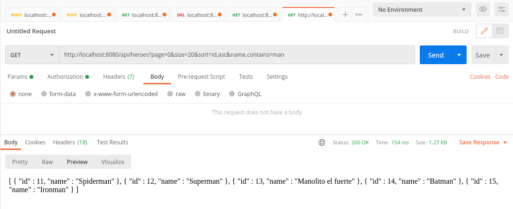  
  
4. Realizamos el update  
  
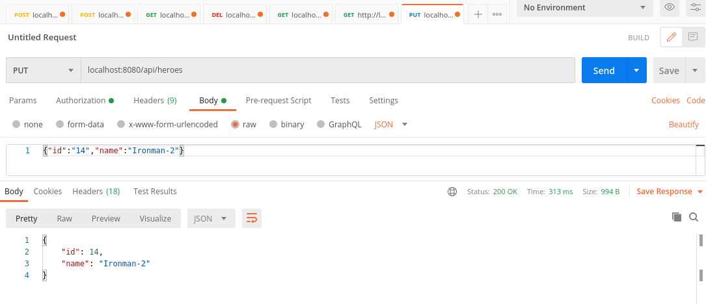  
  
5. Eliminamos un registro  
  
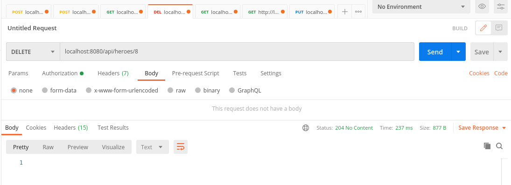  
  
6. Realizamos test  
  
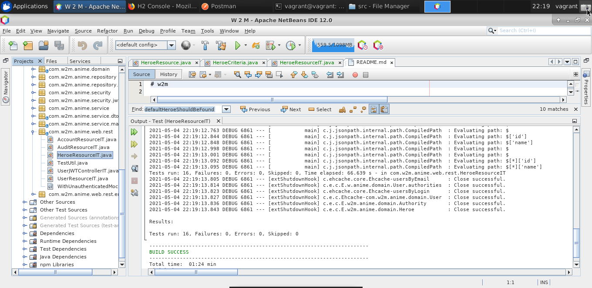  
  
7. La aplicacion esta configurado para utilizar la Base de datos H2 con el perfil dev  
  
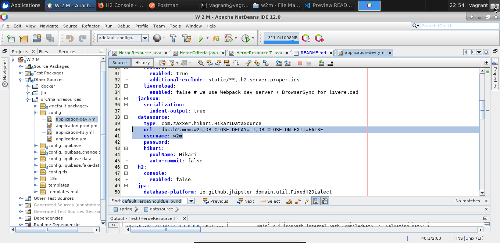  
  

## PUNTOS OPCIONALES  

Usamos liquibase para gestionar los script de Base de datos  

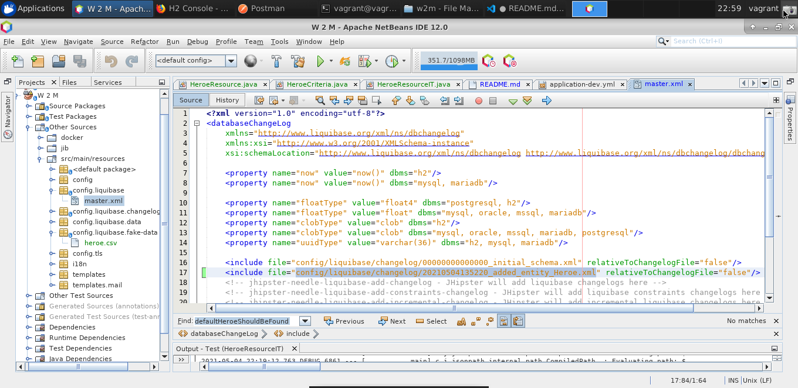  
  
Configuracion del log-back spring para gestionar las trazas de interes  
  
 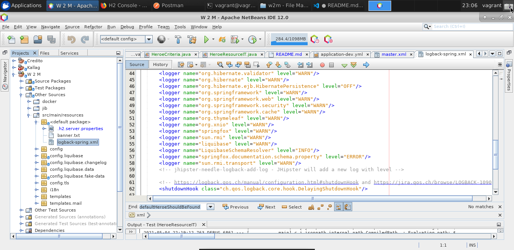   
  
Gestion de errores centralizado  
  
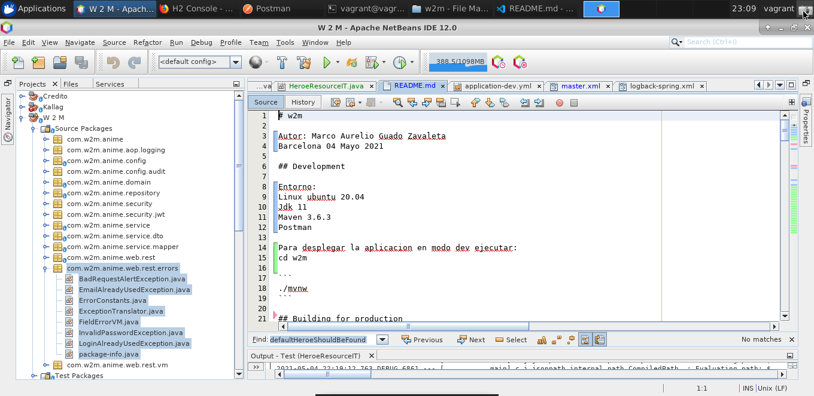  

Tes de integracion, punto 6  
  
La aplicaicon esta configurada para ser ejecutada utilizando Docker  
  
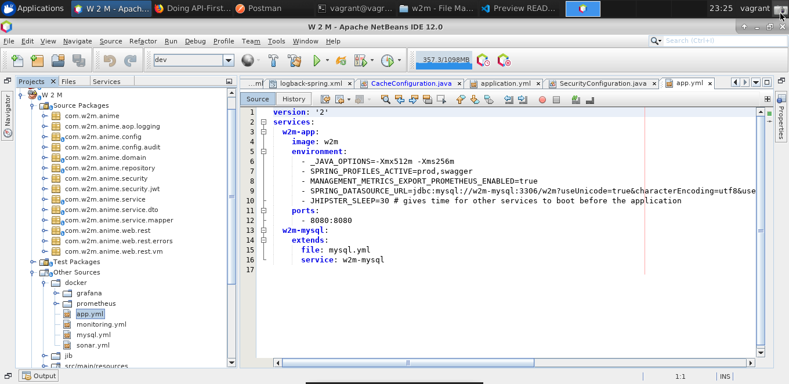    

Poder cachear peticiones, el proyecto esta configurado  
  
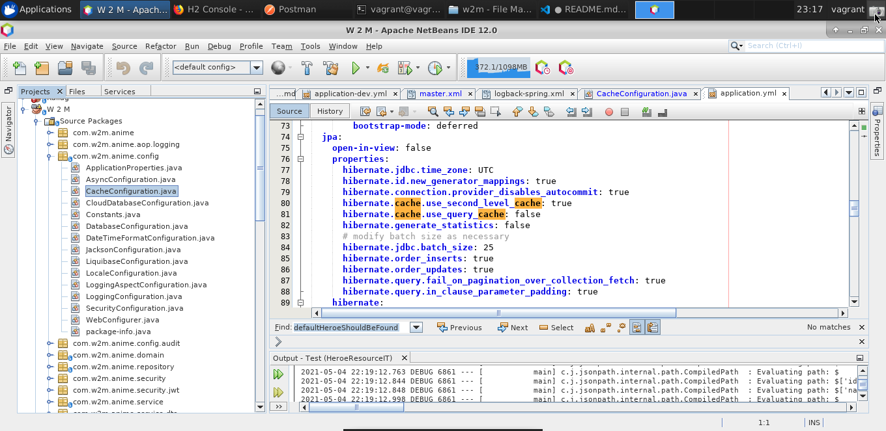  
  
documentacion Apis, es una vista sencilla pero con algun plugin se puede mejorar  
  
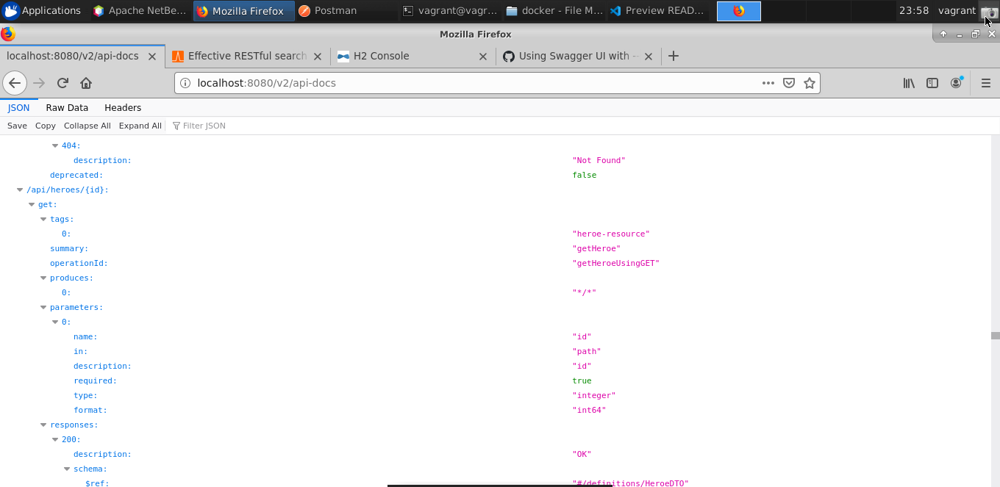  
  

La aplicaicon esta usando Jwt como seguridad de acceso  
  
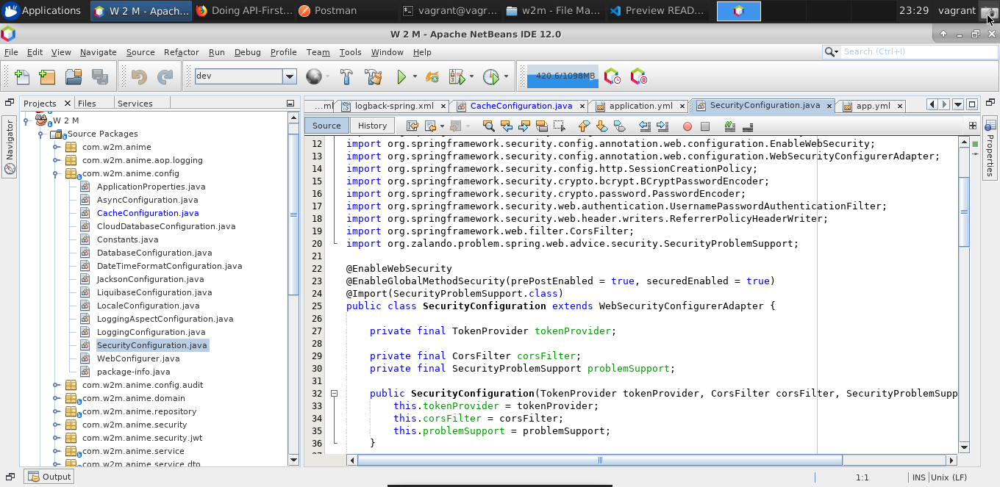   
  
### RESUMEN  
  
La arquitectura propuesta es flexible, extendible y con funcionalidades bien definidas para saber  
en que punto hay que modificar o crear.
  
Cumple con los principios SOLID que se plasman en las diversos packages de la aplicacion:     
configuracion, seguridad, rest, servicios, persistencia etc.


